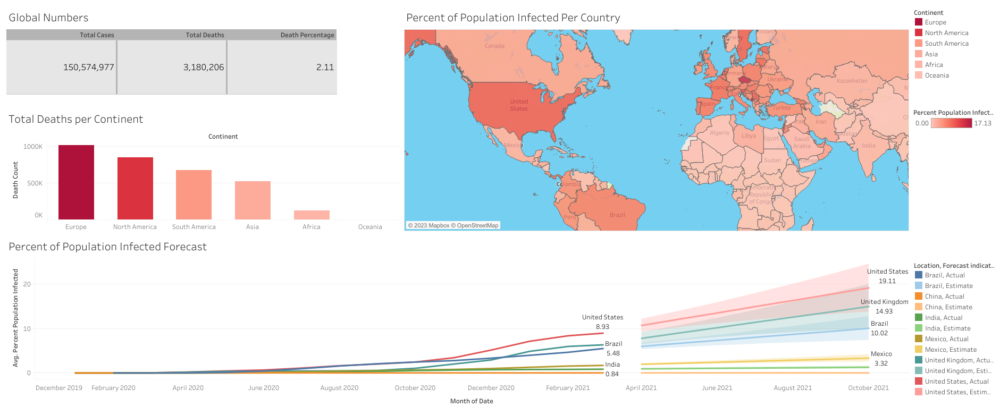

# Covid in Global Numbers Dashboard

This is a simple data exploration project using **SQL** and creating a dashboard with **Tableau**. Its objective is to demonstrate our ability to use these tools in an integrated manner. The database was obtained from the platform [Our World in Data](https://ourworldindata.org/covid-deaths).

## Tools Used:

1. **SQL Server**;
3. **Microsoft Excel**;
2. **Tableau**.

## Solution:

### 01. Data Exploration with SQL Server:

1.1. A SQL Server instance was created using the SQL Server tool with the file obtained from the [Our World in Data](https://ourworldindata.org/covid-deaths) platform. The server was named "PortFolio Project".

1.2. Several visualizations were generated by selecting columns using different SELECT statements (MAX, MIN, AVG, SUM) and WHERE statements (AND, OR, NOT NULL, LIKE).

1.3. Advanced functions such as CTEs (Common Table Expressions) and temporary tables were utilized.

1.4. Initially, the CREATE VIEW function was considered for the next step of this project, which involves data visualization. However, it was ultimately decided that creating new queries for each visualization planned for the dashboard would be more straightforward.

> You can view these steps in the repository's file [DA-Covid.sql](./DA-Covid.sql).

___

### 02. Cleaning Data with Microsoft Excel:

2.1. The data was obtained by executing queries, and the results were saved in separate xlsx files.

> These xlsx files can be found in this repository inside the folder named "to_tableau_".

2.2. Microsoft Excel was primarily used for data cleaning and exporting the cleaned data to Tableau. Null values were converted to 0, and dates were formatted to the short date format (MM/DD/YYYY).

___

### 03. Building a Dashboard with Tableau:

3.1. Every .xlsx were imported to Tableau and for every file a visualization was built in a different sheet.

3.2. A **Text Table** was created displaying the sum of Total Cases, Total Deaths, and Death Percentage for rows and Measure Names for column. This table had colors and lines formatted, and the decimal places for Death Percentage values adjusted by modifying the numbers in fields.

3.2. A **Bar Chart** with Location as columns and sum of Total Death Count as rows. We sorted the chart by field in descending order to have bars displayed in descending values. We renamed the Location columns to Continent. Edited the axis settings.

3.3. The Geographic Role of Location was changed to Country/Region to obtain a range of new data, such as Latitude and Longitude, in order to create a **Map Chart**. Location and Percent Population Infected were selected for marks. The colors of this chart were adjusted to represent the degree of infection in each country.

3.4. Sheet 4 - A **Time Series Analysis** was included: Date (month) for column, row average of Percent Population Infected. A few countries were selected by the severity of COVID infections in their populations, including Brazil, and were differentiated by colors. For the marks, color and label using Location, along with a mark for the Forecast Indicator and a final mark for the label of average Percent of Population Infected.

___

### 04. Dashboard:
The final version appears as follows:

    

The final version of the Dashboard can be accessed on the Public Tableau platform by [clicking here](https://public.tableau.com/views/Covid-Dashboard_16861932893220/Dashboard1?:language=en-US&publish=yes&:display_count=n&:origin=viz_share_link). 

## Conclusion:

A lot was learned from this project. Tools that I hadn't demonstrated integrated usage experience with were utilized: SQL Server, Microsoft Excel, and Tableau. The final Dashboard was also the result of various experiments, and the knowledge gained can easily be applied in business contexts for Data Analysis or Data Science projects.